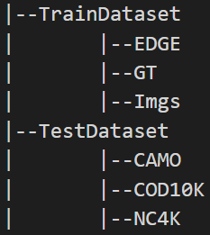

 /># UADNet:a unified assessment and detection network
<!--
 * @Author: Bai Xueqiong
 * @Date: 2026-04-20 16:29:26
 * @Description: UAD-Net
 * 
 * Copyright (c) 2026 by Bai Xueqiong, All Rights Reserved. 
-->

---

## Abstract
Camouflaged Object Detection (COD) and Camouflage Effectiveness Assessment (CEA) are pivotal components for modern maritime reconnaissance and defense systems. However, current COD methods struggle to capture fine-grained textural discrepancies, and traditional CEA metrics rely on low-level statistical features that ignore human visual cognitive mechanisms. To bridge this gap, we propose a unified assessment and detection network (UAD-Net), a bio-inspired framework that unifies high-precision detection with objective assessment. Mimicking the human visual system, we present a module that enhances textural features to capture multi-scale contextual anomalies, and a cross-layer guided edge prediction branch that extracts structural skeletons for use as cognitive anchors. Crucially, an edge-semantic fusion module leverages these structural priors to guide feature aggregation, effectively suppressing maritime clutter while precisely localizing target boundaries. Furthermore, we construct MC1K, the first maritime camouflage benchmark containing 1,750 high-fidelity images with pixel-level masks, edge annotations, and cognitive ranks derived from eye-tracking experiments. Extensive experiments using MC1K and three public datasets demonstrate that UAD-Net significantly outperforms 20 state-of-the-art methods in terms of metrics such $S_{\alpha}$, $F_{\beta}^w$, mean absolute error, $E_{\phi}$. This work marks a paradigm shift from "pixel-wise similarity" to "cognitive-level detectability," thereby offering a novel visual diagnosis tool for the design and optimization of military camouflage.

## 数据集
使用CAMO，COD10K，NC4K三个数据集进行训练和测试，相关设置如下：
| Datasets  | CAMO        | COD10K      | NC4K          | sum |
| :---      | :----:      |    :----:   |          ---: |---: |
| train     | 1000        | 3040        |  0            |4040 |
| test      | 250         | 2026        | 4121          |6397 |
| sum       | 1250        | 5056        | 4121          |10137|

在训练及测试前，将数据集进行处理如下： 
数据文件夹结构如下：  
  
其中，所有训练集图片全部整合进TrainDataset-Imgs文件夹，GT为真值图，EDGE为伪装目标边缘图像；EDGE，GT中图像名称与Imgs中文件名称一一对应，但文件后缀不同，训练及测试中对文件对应的相关处理可参考utils--dataloader.py、dataloader_edge.py。

## 依赖包
见 requirements.txt

## 运行程序

1. 环境配置:
    
    + 创建Pytorch环境：具体过程略
    
    + 安装依赖包: 程序依赖包见`requirements.txt`.

2. 下载数据集:

    + 测试集地址： [download link (Google Drive)](https://drive.google.com/file/d/1SLRB5Wg1Hdy7CQ74s3mTQ3ChhjFRSFdZ/view?usp=sharing).
    
    + 训练集地址： [download link (Google Drive)](https://drive.google.com/file/d/1Kifp7I0n9dlWKXXNIbN7kgyokoRY4Yz7/view?usp=sharing).
    
    + 模型参数，可用于推理，评估。位于： `./checkpoints\Net_epoch_best_22.pth`, 
    

3. 训练设置:

    + 请修改`MyTrain.py`中的相关参数， `--train_save` and `--train_path` in `MyTrain.py`.
  

4. Testing Configuration:

    + After you download all the pre-trained model and testing dataset, just run `MyTest.py` to generate the final prediction map: 
    replace your trained model directory (`--pth_path`).

## 评估模型
1. 评估步骤
   + 首先通过测试代码，生成待评估的图像
   + 修改评估程序中相关参数，并运行评估程序  
2. 评估程序地址
   + 可以选择使用MATLAB代码进行评估(revised from [link](https://github.com/DengPingFan/CODToolbox)), .
   + 如使用python进行评估，需要安装相应库[link](https://github.com/lartpang/PySODMetrics) by `pip install pysodmetrics`.
   作者根据需要，也以相关库为基础，修改了Python代码，见 `./metrics/eval.py` 运行后自动将评估结果输出到xlx文件中
